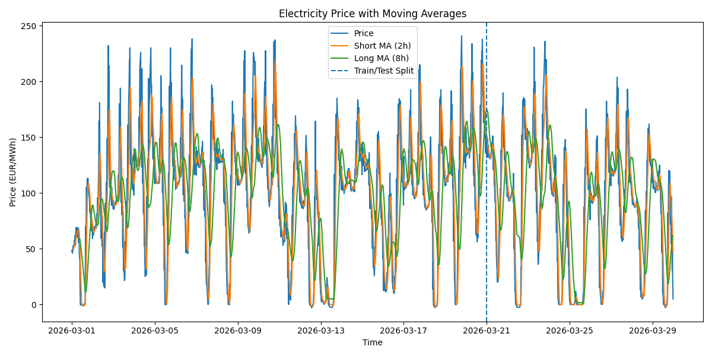
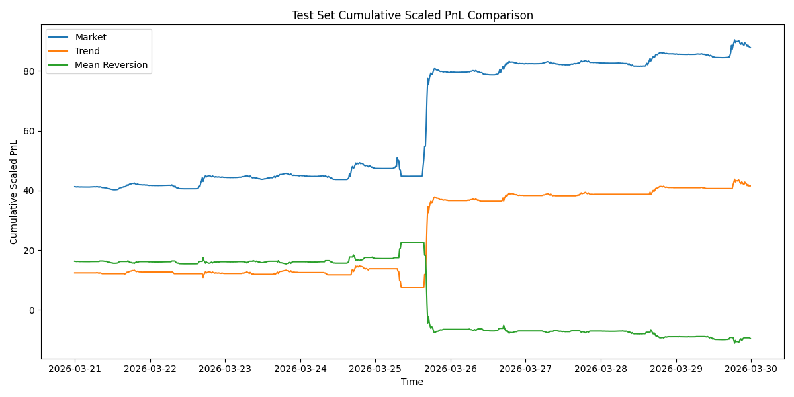

# Short-Term Electricity Price Forecasting and Trading Strategy

## Overview

This project explores short-term trading behaviour in the electricity market using 15-minute German day-ahead price data.

Instead of starting from a predefined model, I approached this as a bottom-up exercise:
beginning with raw data, building a clean time series, testing simple hypotheses, and gradually refining strategies based on observed market behaviour.

The goal is not to build a “profitable system”, but to understand how standard financial ideas behave in a real, noisy, and regime-dependent market.

---

## Dataset

* Source: ENTSO-E Transparency Platform
* Market: Germany (BZN|DE-LU)
* Frequency: 15-minute intervals
* Period: March 2026

The dataset reflects intraday dynamics with frequent spikes, structural breaks, and non-stationary behaviour — making it very different from typical equity time series.

---

## Data Processing

The raw data was not directly usable and required several steps:

* Merged daily CSV files into a continuous dataset
* Parsed timestamps from MTU format
* Removed duplicated entries (multiple sequences per interval)
* Filtered extreme values (top/bottom 1%) to reduce distortion from spikes
* Sorted and aligned into a consistent time series

The result is a clean dataset suitable for short-term signal testing.

---

## How I Approached the Problem

Rather than jumping straight into modelling, I started with a simple question:

> Does electricity price behave more like a trending process or a mean-reverting one?

This led to two initial hypotheses:

* If prices exhibit persistence → trend-following should work
* If prices revert to a local equilibrium → mean-reversion should work

From there, I implemented both and compared them under the same conditions.

---

## Methodology

### Train / Test Split

To avoid misleading conclusions, I split the data:

* Train: before 2026-03-21
* Test: after 2026-03-21

This ensures all conclusions are validated out-of-sample.

---

### Strategy 1: Trend-Following

* Short moving average: 2 hours
* Long moving average: 8 hours

Signal:

* Long when short MA > long MA
* Flat otherwise

This tests whether short-term momentum exists in electricity prices.

---

### Strategy 2: Mean-Reversion

* Rolling window: 8 hours
* Z-score based signal

Logic:

* Short when price is significantly above rolling mean
* Long when price is significantly below
* Exit near equilibrium

A cooldown mechanism was added to reduce over-trading.

---

### Backtesting Design

* Transaction costs included
* Signals shifted to avoid look-ahead bias
* Evaluated using PnL, Sharpe ratio, and drawdown

---

## Results





### Key Observations

* Mean-reversion performed reasonably well in the training set
* However, it broke down completely in the test period
* Trend-following, while not perfect, was more stable out-of-sample

---

## What This Suggests

The most important takeaway is not which strategy “wins”, but why:

* Electricity prices are highly **regime-dependent**
* Behaviour observed in one period does not generalise reliably
* Simple strategies can appear strong in-sample but fail quickly out-of-sample

This reinforces a key idea:

> Backtesting without proper validation can be misleading.

---

## Project Structure

```text
src/
  merge_and_clean.py        # data cleaning and preprocessing
  model_and_strategy.py     # signal generation and backtesting

data/
  clean_price_data.csv      # processed dataset

results/
  *.png                     # visualisations
  *.csv                     # backtest outputs

requirements.txt
README.md
```

---

## Final Thoughts

This project was built as an exploratory step into electricity markets.

What stands out is how different this domain is from traditional financial assets:

* more noise
* more structural breaks
* stronger dependence on external factors

The process of building, testing, and seeing strategies fail was as valuable as any “successful” result.

---

## Future Work

* Incorporate external drivers (demand, renewables, weather)
* Try predictive models instead of rule-based signals
* Explore regime detection before applying strategies

---
